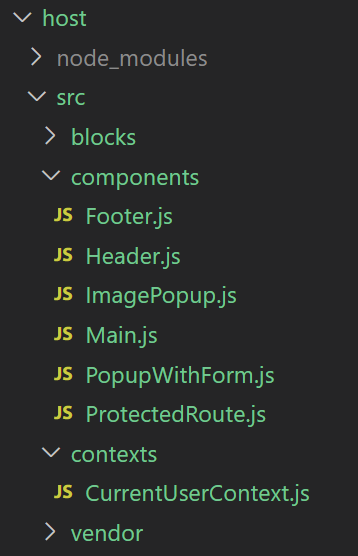
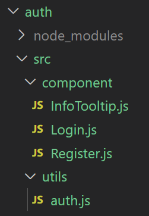
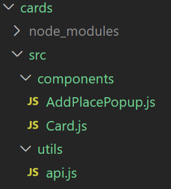
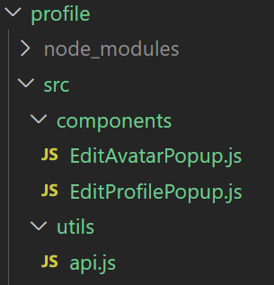
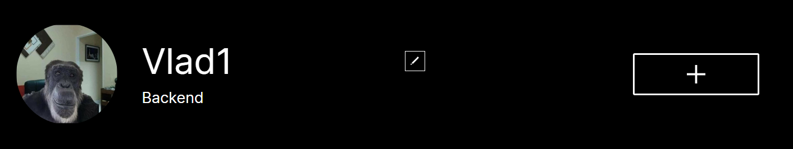

# Проектирование
Основное приложение можно разделить на несколько доменов:

1. Компонент входа и регистрации пользователя
2. Компонент галереи фотографий с функционалом лайков
3. Компонент работы с профилем пользователя (смена фотографии, имени)
4. Компонент мастер-страницы, содержащей общие компоненты (Header, Footer)

# Планирование изменений
Приложение будет разбито на микрофронтенды при помощи Module Federation.

### Приложение host
* Содержит все стили в каталоге blocks
* Перенесены общие компоненты (Footer, Header, Main, ProtectedRoute, PopupWithForm, ImagePopup)
* Перенесён модуль CurrentUserContext
* Перенесены шрифты

#### Структура файлов

### Приложение auth
* Перенесены компоненты (Login, Register, InfoTooltip)
* Перенесён сервис auth

#### Структура файлов

### Приложение cards
* Перенесены компоненты AddPlacePopup, Card
* Частично перенесён сервис API. А именно только функции для работы с карточками и лайками

#### Структура файлов

### Приложение profile
* Перенесены компоненты EditAvatarPopup, EditProfilePopup
* Частично перенесён сервис API. А именно только функции для работы пользователем. (getUserInfo, setUserInfo, setUserAvatar)

#### Структура файлов

`Так как микрофронтенд профиля содержит кнопку контрол добавления новой карточки, то для реализации этого функционала необходимо реализовать функционал взаимодействия микрофронтендов и при помощи него производить вызов метод addCard приложения "cards"`

# Реализация
Не выполнена

# ЗАДАНИЕ 2
Ссылка на файл схемы - https://drive.google.com/file/d/1-CaS7ma8U2HA6Io_zu0WCN5xg6mP4ZHM/view?usp=sharing