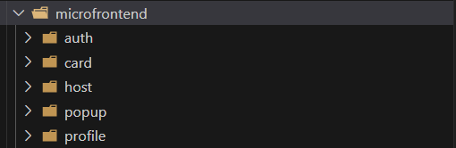
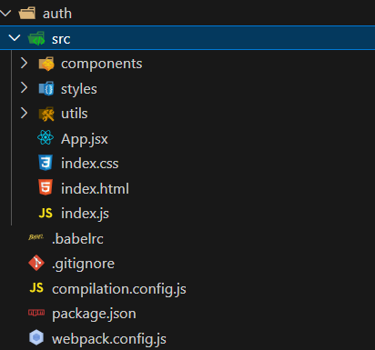
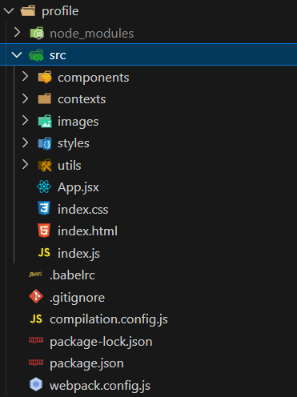
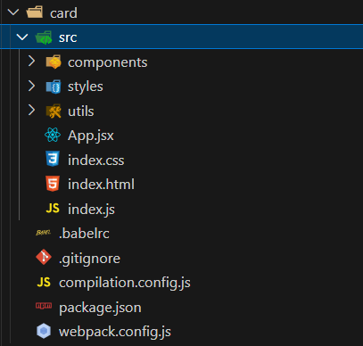
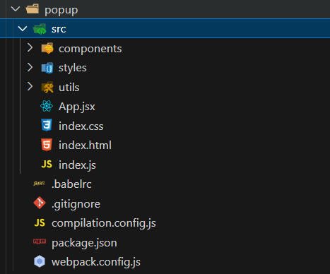

<h2>Архитектура микрофронтента</h2>  

Cтуктура микрофронтента auth

<b>Функциональность:</b> Микрофронтенд "Auth" отвечает за управление аутентификацией и авторизацией пользователей. Это включает страницы входа, регистрации и восстановления пароля. 
<b>Преимущества:</b>
<b>Модульность:</b> Изоляция аутентификационных процессов позволяет команде быстрее вносить изменения или обновления, не влияя на основные функции приложения. 
<b>Безопасность:</b> Отдельная структура позволяет сконцентрироваться на аспектах безопасности, таких как обработка данных пользователей и хранение токенов. 
Лучшая архитектура: Разделение позволяет применять специфические для аутентификации шаблоны и библиотеки (например, OpenID, OAuth), что упрощает интеграцию с другими системами. 

Cтуктура микрофронтента profile
 

<b>Функциональность:</b> Этот микрофронтенд управляет отображением и редактированием профиля пользователя, включая персональные данные, настройки и аватар. 
<b>Преимущества:</b> 
<b>Интуитивный интерфейс:</b> Изолирование профиля позволяет командам разрабатывать интерфейсы, специально ориентированные на UX для работы с пользовательскими данными. 
<b>Гибкость:</b> Команда может добавлять новые функции (например, интеграцию с социальными сетями) независимо от других компонентов приложения. 
<b>Распределение нагрузки:</b> Микрофронтенд может загружаться по отдельности, что улучшает производительность приложения в целом, особенно в условиях высокой нагрузки. 

Cтуктура микрофронтента card

<b>Функциональность:</b>: Этот компонент отвечает за отображение карточек, которые могут содержать информацию о пользователях, новых уведомлениях или других данных. 
<b>Преимущества:</b> 
Повышение производительности: Возможность кэширования и оптимизации процессов рендеринга карточек отдельно от остального интерфейса. 
<b>Стандартизация:</b> Легче контролировать вид и поведение карточек, соблюдая единые стандарты дизайна и взаимодействия. 
Легкость в использовании: Разделение позволяет группе разработчиков сосредоточиться на улучшении визуального представления без изменения остального кода.

Cтуктура микрофронтента popap

<b>Функциональность:</b> Ответственный за всплывающие окна, которые могут отображать уведомления, формы или дополнительные действия. 
<b>Преимущества:</b> 
<b>Повторное использование:</b> Возможность использования одного и того же компонента в разных частях приложения значительно снижает дублирование кода и делает архитектуру более чистой. 
Контроль состояния:</b> Легче управлять состоянием и поведением всплывающих окон, так как они могут быть отдельно от основного состояния приложения. 
<b>Адаптивность:</b> Можно адаптировать всплывающие окна под разные разрешения и устройства без влияния на другие микрофронтенды. 

<h2>Архитектура микросервиса</h2>  

https://drive.google.com/file/d/1bu_hZdWpU3tJ1KWkT7clJy-Tz6g3i9PB/view?usp=sharing