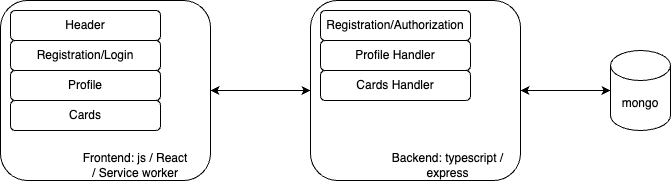

# Описание проектной работы первого спринта, приложение Mesto

## Структура исходного проекта

### Исходная структура проекта

Текущее решение представляет из себя монорепозиторий, в котором расположены и backend, и frontend, и общий скприт для сборки всего решения. Основные директории фронтэнда:

1. frontend/src - основные исходники проекта, корень приложения (index.js), сервис воркер (serviceWorker.js), заготовка для тестов
2. frontend/src/blocks - стили для всех блоков сайта
3. frontend/src/components - общий каталог с версткой и логикой компонент приложения. Стоит отметить компонент App.js - где создается React-приложение, объявлены функции для работы с функциональными блоками, находится верстка главной страницы.
4. frontend/src/context - создан react-контекст для передачи данных через дерево компонент.
5. frontend/src/images - статические картинки
6. frontend/src/utils - методы для работы с API
7. frontend/src/vendor - стили и шрифты

### Компоненты и модули

Логически решение можно разделить на следующие домены:

1. Компоненты общего назначения (хостовые - App, Header, Footer, ProtectedRoute)
2. Регистрация/авторизация (Login, Register, InfoTooltip)
3. Управление пользователями, в том числе регистрация/авторизация (Main, PopupWithForm, EditProfilePopup, EditAvatarPopup)
4. Управление карточками мест (ImagePopup, Card, AddPlacePopup)

## Проектирование

В качестве фреймворка для создания микрофронтэндов выбран Module Federation. Это позволяет разделять код между несколькими независимыми приложениями и динамически загружать его в браузере пользователя. В результате над кодом различных микрофронтэндов команды разработки могут работать и деплоить независимо, ускоряется начальная загрузка приложения.

###  Обновленная структура проекта

Исходя из доменных зон приложения, его можно поделить на следующие микрофронтэнды:

1. _Хост-приложение_ - главное окно, инкапсулирует все остальные микрофронтэнды и предоставляет хэдер-футер.
2. _Приложение для аутентификации_ - предоставляет функционал регистрации и авторизации пользователей.
3. _Приложение для управления профелем_ - предоставляет функционал для редатирования/отображения профиля.
4. _Приложение для управления карточками_ - функционал для отображения, добавления карточек с местами, лайки/дизлайки.

### Дерево каталогов

- _host_
  - _/src_
    - _/components_
      - Header.js - Хедер страницы
      - Footer.js - Футер страницы
      - ProtectedRoute.js - Компонент маршрутизации
      - Main.js – Главный компонент для отображения профиля и карточек
    - /styles
      - content - Стили для контента страницы
      - header - Стили для компонента хидера
      - footer - Стили для компонента футера
      - page - Стили для страницы
    - index.js - Точка входа хостового приложения
  - package.json - Зависимости и скрипты микрофронтенда
  - webpack.config.js - Конфиг для сборки с помощью webpack

- _auth_
  - _/src_
    - _/components_
      - Login.js – Компонент логина пользователя
      - Register.js – Компонент регистрации пользователя
    - _/styles_
      - login – Стили для компонента логина
      - auth-form – Стили для компонента регистрации
    - _/utils_
      - auth.js – Протокол для аутентификации
    - index.js – Точка входа микрофронтенда
  - package.json – Зависимости и скрипты микрофронтенда
  - webpack.config.js - Конфиг для сборки с помощью webpack

- _profile_
  - _/src_
    - _/components_
      - EditProfilePopup.js – Компонент для редактирования профиля
      - EditAvatarPopup.js – Компонент для обновления аватара
    - _/utils_
      - api.js – Утилиты для работы с API профиля
    - _/styles_
      - profile – Стили для компонента профиля
    - index.js – Точка входа микрофронтенда
  - package.json – Зависимости и скрипты микрофронтенда
  - webpack.config.js - Конфиг для сборки с помощью webpack

- _/places_
  - _/src_
    - _/components_
      - Card.js – Компонент для отображения карточки
      - AddPlacePopup.js – Компонент для добавления новой карточки
      - ImagePopup.js – Компонент для отображения увеличенной карточки
    - _/utils_
      - api.js – Утилиты для работы с API карточек
    - _/styles_
      - card – Стили для карточек
      - popup – Стили для всплывающих окон
    - index.js – Точка входа микрофронтенда
  - package.json – Зависимости и скрипты микрофронтенда
  - webpack.config.js - Конфиг для сборки с помощью webpack
