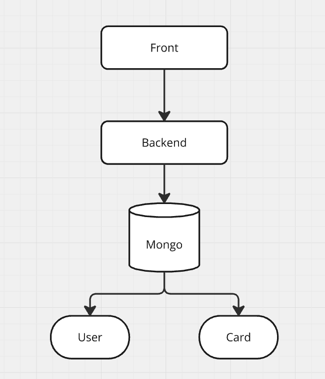
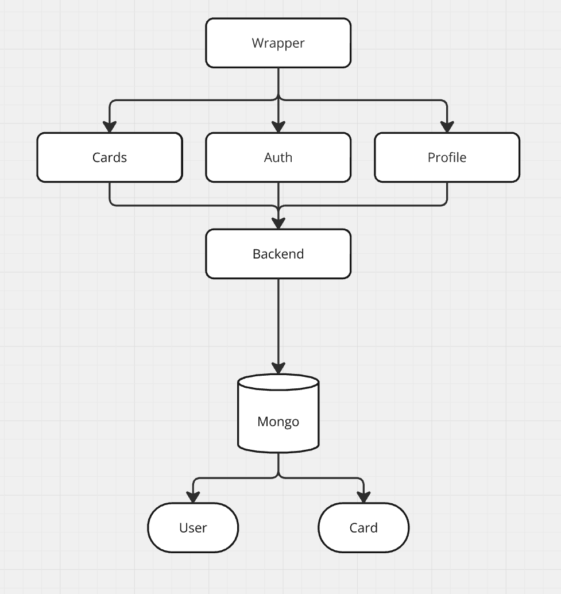
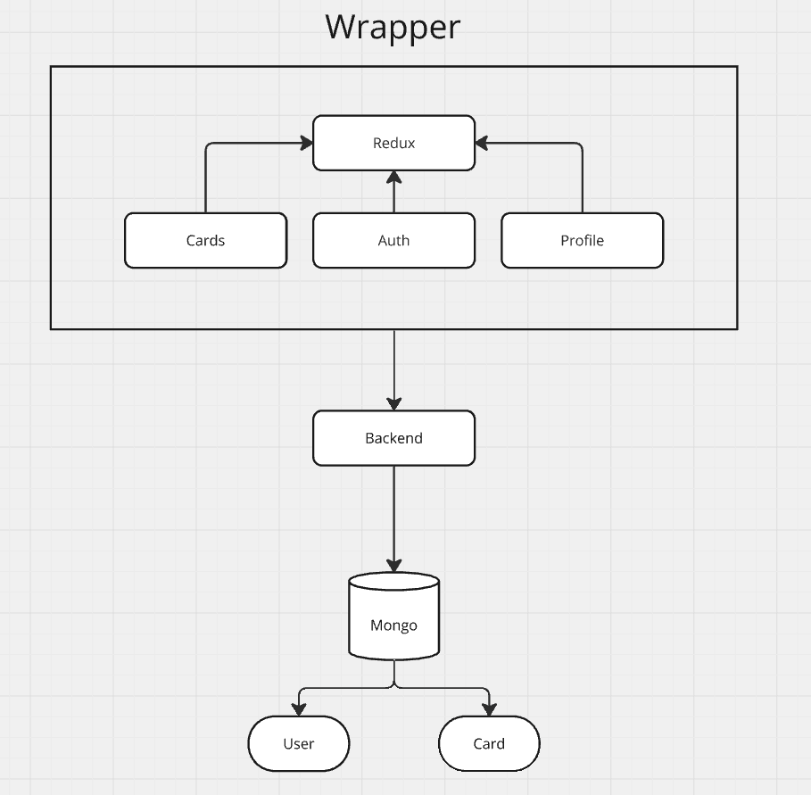

# Задание (№1) Микрофронты
******
## План
1. Анализ проекта
2. Определение бизнес-доменов(нарезка микрофронтендов)
3. Выбор фреймворка реализации микрофронтендов
4. Реализация микрофронтов
5. Реализация взаимодействия микрофронтендов

## 1. Анализ проекта
Проект "Mesto" представляет из себя сервис - блог, с возможностью создания публичного архива фотографий. <br/>
Сервис предоставляет возможность загрузки/удаления фотографий, а так же коммуникации между пользователя посредством </br>
системы сбора и учета лайков.</br>

Под капотом сервис представляет из себя монолитное проект состоящий из:
* Веб-приложения на React 17-й версии.
* Backend приложения на Node.js & express.
* Базы данных MongoDB.

Общение между фронтом и беком основывается на REST API, backend предоставляет возможность CRUD для следующих сущностей:<br/>

* Карточка
```
    /** Назавние карточки */  
    name: string;
    /** Ссылка на картинку */
    link: string;
    /** Пользователь создавший карточку */
    owner: ObjectId;
    /** Лайки */
    likes: ObjectId[];
    /** Дата создания */
    createdAt: Date | string;
```
* Пользователь
```
    /** Имя пользователя */
    name: string;
    /** Описание профиля */
    about: string;
    /** URL аватарки пользователя */
    avatar: string;
    /** Email */
    email: string;
    /** Пароль */
    password: string;
```

Архитектура проекта в текущей реализации выглядит следующим образом: <br/>

***
Само веб-приложение является Single Page Application со следующими страницами:
* /signup - страница регистрации
* /signin - страница авторизации
* / - protected страница пользователя, где присутствует функционал работы с карточками.

Так же веб-приложение включает в себя модалки:
* Модалка редактирования пользователя
* Модалка добавления карточки
* Диалоговая модалка подтверждения
* Модалка редактирования аватарки пользователя
* Модалка просмотра карточки
* Модалка удаления карточки

***
## 2. Определение бизнес-доменов
Исходя из анализа проекта выше, мы можем выделить дерево бизнес-функций с сущностями:<br/>
* Пользователь
  * Авторизация/Регистрация
  * Редактирование профиля пользователя
* Карточки
    * Просмотр карточек
    * Создание карточек
    * Редактирование карточек
    * Удаление карточек
  
Следовательно, основываясь на дереве выше и на страницах приложения можно выделить следующие микрофронты:
* Wrapper - корневой компонент, микрофронт, который будет хранить в себе глобальные состояния
и общие функции(utils), общие компоненты, UI-компоненты, например диалоговую модалку подтверждеия.
В этот микрофронт мы будет подключать остальные.
*  Auth - микрофронт авторизации, который будет включать в себя возможность авторизации/регистрации, который мы будем показывать на страницах
/signup и /signin.
* Profile - микрофронт реализующий редактирование профиля, который мы будем показывать на странице /
* Cards - микрофронт карточек, который будет предоставлять возможность вывода списка карточек, их просмотра, редактирования/удаления и учет лайков.

На данном этапе имеем следующую визуализацию архитектуры приложения без детальной реализации микрофронтов:


## 3. Выбор фреймворка реализации микрофронтендов
Исходя из анализа проекта и нарезки доменов, мы видим достаточно минималистичные микрофронты, которые реализованы на едином стеке.<br/>
Выделенные микрофронтенды не требуют большой команды для масштабирования или переезда части компонентов на другой фреймворк. И так как проект небольшой, то
и нет особой надобности и думать над оптимизацией метрик времени загрузки страниц. Следовательно в Single SPA нет необходимости и нам здесь
Больше подходит Webpack/Vite Module Federation.

## 4. Реализация Микрофронтендов
Следуя логике наших доменов, мы создаем микрофронтенды со следующей файловой структурой:
```
   |-mf-auth
   |---blocks
   |-----auth-form
   |-------__button
   |-------__form
   |-------__input
   |-------__link
   |-------__text
   |-------__textfield
   |-------__title
   |-----login
   |---components
   |-mf-cards
   |---blocks
   |-----card
   |-------__delete-button
   |---------_hidden
   |---------_visible
   |-------__description
   |-------__image
   |-------__like-button
   |---------_is-active
   |-------__like-count
   |-------__title
   |-----places
   |-------__item
   |-------__list
   |---components
   |-mf-profile
   |---blocks
   |-----profile
   |-------__add-button
   |-------__description
   |-------__edit-button
   |-------__image
   |-------__info
   |-------__title
   |---components
   |-mf-wrapper
   |---blocks
   |-----content
   |-----footer
   |-------__copyright
   |-----header
   |-------__auth-link
   |-------__logo
   |-------__logout
   |-------__user
   |-------__wrapper
   |-----page
   |-------__content
   |-------__section
   |-----popup
   |-------__button
   |---------_disabled
   |-------__caption
   |-------__close
   |-------__content
   |---------_content
   |-------__error
   |---------_visible
   |-------__form
   |-------__icon
   |-------__image
   |-------__input
   |---------_type
   |-------__label
   |-------__status-message
   |-------__title
   |-------_is-opened
   |-------_type
   |---components
```
В данной имплементации нет необходимости изоляции микрофронтов, поэтому мы будем использовать возможность переиспользовать код
внутри Webpack Module Federation, например для стилей модалок(mf-wrapper/blocks/popup)

## Реализация общения между фронтами
Для реализации общения между микрофронтами в текущей реализации нет необходимости использовать Event Bus(Паттерн Наблюдатель)
И нет необходимости общения по API, следовательно будем использовать любой state manager, например - Redux/Effector,
который будет хранить в себе информацию о пользователе.

Итоговая архитектура проекта выглядит следующим образом:


# Задание (№2)
***
* https://drive.google.com/file/d/1xfhZikSctOQeyXIvGIRAkRJshMoQDuyN/view?usp=sharing
 